# Supervised-Learning

## Single layer feedforward neural network

Requires: [cANN.cls](Modules/cANN.cls), [modMath.bas](../../../Scientific-Toolkit/blob/master/Modules/modMath.bas)

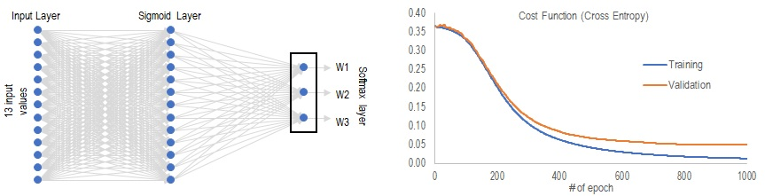

Test data here is wine data set from [UCI Machine Learning Repository](https://archive.ics.uci.edu/ml/datasets.html)<sup>1</sup>. It consists of 178 samples of wines made from three different cultivars, which will be named as classes 1, 2 and 3 in the following sections. 13 attributes of these wine samples were measured. Data is read in as an array of *x(1:N,1:D)* where N=178 and D=13 are the number of samples and dimensions respectivly. *x_class(1:N)* holds the class label of each sample.

1. Forina, M. et al. [UCI Machine Learning Repository](http://archive.ics.uci.edu/ml). Institute of Pharmaceutical and Food Analysis and Technologies. 

#### 1. Prep the data

Before we start, first normalize data *x()* and use `modmath.Class2Vec` to convert the class labels to vectors of 0 and 1. So class 1 is represented by a vector of (1 0 0), class 2 by (0 1 0) and class 3 by (0 0 1). The vector is stored in *x_class_vec()'.

```
  Call modMath.Normalize_x(x, x_shift, x_scale, "AVGSD") 'Normalize data to zero mean and unit variance
  Call modMath.Class2Vec(x_class, x_class_vec, n_output, class_map) 'vectorize labels
```

#### 2. Split the data into training, validation and test set

Remember that the data you get may have been sorted in some way. In this case the data from UCI is sorted by class label. If you directly split the data in half you will end up with samples bias to a certain class. So it's a good idea to shuffle the dataset first.

```
    iTrain = modMath.index_array(1, n_raw)  'generate pointers 1 to N for each data
    Call modMath.Shuffle(iTrain) 'Shuffle the pointers
```
Now split the set into training/validation/test set by portion of 70/30/78.

```
    Call modMath.MidArray(iTrain, 71, 100, iValid)  'pointer to validation set
    Call modMath.MidArray(iTrain, 101, 178, iTest)  'pointer to test set
    ReDim Preserve iTrain(1 To n_train)             'pointer to training set
    
    'Separate data into train, validation and test set
    Call modMath.Filter_Array(x, x_train, iTrain)
    Call modMath.Filter_Array(x_class, x_class_train, iTrain)
    Call modMath.Filter_Array(x_class_vec, x_class_vec_train, iTrain)
    
    '...repeat for validation and test set
```

#### 3. Train neural network
Now we can feed the training and validation sets into our ANN. We will set the number of hidden units to 13 in this example. Figure on the above left shows the architecture of this network. Activation functions are hard coded to be sigmoid and softmax in the hidden and output layer respectively.

Syntax to initialize and train the network is as below:
```  
  Dim ANN1 As New cANN
  With ANN1
    Call .Init(n_input, n_output, 13)     'Initialize
    Call .Trainer(x_train, x_class_vec_train, , , , , , x_valid, x_class_vec_valid)
    cost_function=.cost_function
  End With
```

The cost function at every epoch can is pulled out and shown on the upper right figure. Note how the cost function continued to drop in the training set after about 600 epochs but stopped improving in the validation set. This could be a sign of overfitting, which is why we want to have a validation set to make sure we know when to stop training.

Now we are ready to test the model on the training set
```      
  Call ANN1.InOut(x_train, y)
  Call modMath.Vec2Class(y, class_map, x_class_out) 'Recover class label
```
The two charts below show the accuracy of our trained network. Accuracy on traing set is 100%. On the test set, it makes one incorrect prediction, it misclassifies a class2 sample as class3.

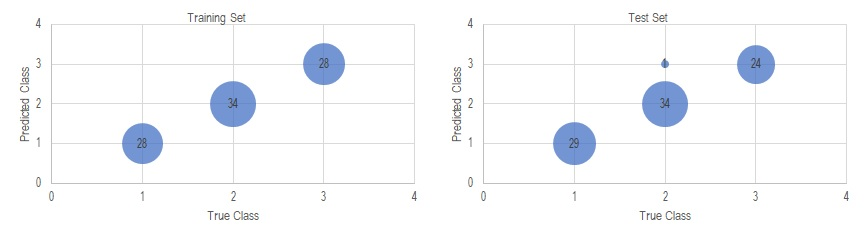

#### 4. Save trained network
The trained network weights can be printed to an Excel worksheet with
```
Call ANN1.Print_Model(wksht)
```

which can be reused next time by the read command
```
Call ANN1.Read_Model(wksht)
```

## Recurrent Neutral Network with Long-Short-Term-Memory (LSTM) unit

For this example we experiment with natural language processing (NLP), using text from "Alice in Wonderland". To keep things simple, only the first few paragraphs are used. That contains ~4000 characters including punctuations and spaces. All letters are converted to lower case. Linebreaks are removed.

The stream of charaters are stored in a vector *strArr(1:N)*, which is then converted to a binary vector with a codebook, using:
```
Call modMath.Class2Vec(strArr, strVec, n_dimension, codebook)
```
So *strVec(1:N, 1:n_dimension)* is an array of 0 and 1. Where the non-zero position corresponds to a character in the code book, which is a vector of length n_dimenison.

The full data is then split into segments for batch training. In this example let's say we use sequences of length 30 and the goal is to predict the 31-st character. So we split the full series into set of sequences of length 30, and another set also of length 30 but offset by 1 step as the target sequence.
```
Call Sequence2Segments(strVec, y_input, 30, 1, 3)   'segments of length 30 starting from the 1st position
Call Sequence2Segments(strVec, y_target, 30, 2, 3)  'segments of length 30 starting from the 2nd position
```

Now we are ready to train a LSTM network. There are two classes of LSTM implemeted: cLSTM.cls and cLSTM_B.cls for unidirectional and bidirectional network. The loss function used is mutliclass cross entropy with a softmax output layer. The implementation is fairly basic without any dropout or regularization. Let's just see what that gets to:
```
Dim LSTM1 As cLSTM
Set LSTM1 = New cLSTM
With LSTM1
    Call .Init(n_dimension, 80, n_dimension)    'LSTM with 80 hidden units
    Call .Train_Batch(xS, y_tgt, , 0.01, , 20)  'train for 20 epochs with learning rate of 0.01
    cost_function = .cost_function              'Print model
    .Print_Model(wksht)
End With
```
After the training is done. Use `.cost_function` to print the cost function to see that it has converged. Also use `.Print_Model(wksht as WorkSheet)` to print the trained weights and save it. This is important since you certainly don't want to spend another day to train it from scratch. With a saved model, you can read it back it with `.Read_Model(wksht)`, then use it or continue to train it. Let's just try it to see what it's learnt.

When the network was given the keywords "alice" and "rabbit" and asked to generate a sentences of 50 characters using the command 'LSTM1.Generate(strSeed, 50, 20)', it generates this: 

|Input | Output |
|------|--------|
| alice | alice to herself, \`at thought the ent out again. t|
| rabbit | rabbit-hole ont mooked at the tith the antipat thi|

Well, not very meaningful...but at least it gets some spellings correct. So now you have it : your own chatbot that talks garbage! My wife used to talk to a Christian Grey chatbot on Facebook which sounds even more garb-lish. At least with this one you can train it on your favorite topics.

Obviously a real deal NLP will need much more training sample, the training model will be more invovled, and you definitely will not run a language training model in VBA. I just want to show you how it works.

In fact if you are working in the financial industry, you are more likely to be predicting continuous signal (i.e. price) instead of categorical signal. In that case the model can be easily modified to use a mean-sqaure-error loss function and a sigmoid or linear output activation.

## Convolutional neural network

Requires: [cCNN.cls](Modules/cCNN.cls), [cConvLayer.cls](Modules/cConvLayer.cls), [cPoolLayer.cls](Modules/cPoolLayer.cls),[modMath.bas](../../../Scientific-Toolkit/blob/master/Modules/modMath.bas)

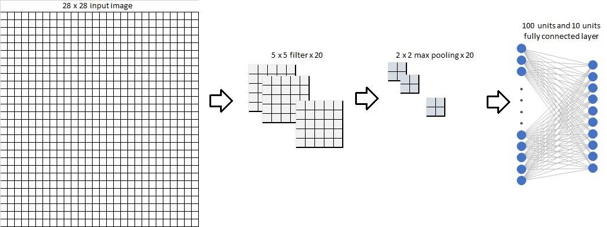

Another very common and basic type of neural network is a convolutional nural network (CNN). It is particularly useful in classification tasks of 2-dimensional images. In this example, we will take the famous MNIST data set, which consists of 70,000 samples of hand written numeric digits from 0 to 9, in grey scale and centered in a 28x28 frame.

I won't bore you with the intricacies of feeding in the data, which depends on how you obtain them for each specific task. In my implementation, the 28x28 matrix is converted into 1D-vector of length 784 according to the scheme shown below. I found that VBA read and write to vector a bit faster than directly operating on a 2D-matrix.

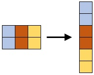

First let's specify the architecture of our CNN, which accepts as an input a 28x28 image of single channel (for RGB image it will be 3 channels). It is then followed by a 5x5 convolutional layer of stride length 1 with 20 channels, using RELU activation. It's then followed by a 2x2 max pooling layer of stride length 2. After that we stack a fully connected layer of 100 sigmoid units. The final output layer is a fully connected softmax layer with 10 units, correspoding to the 0-9 classification task. The syntax looks like this
```
Set CNN1 = New cCNN
With CNN1
    Call .Init(28, 28, 1, 10, 20, 5, 5, 1, "CONV", "RELU")
    Call .Add_Layer("POOL", , 2, 2, 2, "MAX")
    Call .Add_Layer("FULL", 100, , , , "SIGMOID")
    Call .Add_Layer("FULL", 10, , , , "SOFTMAX")
End With
```
Once specified, we can start training the model. For demonstration purpose, let's train it on only 4000 images and 250 validation images and test it on another 250 images. We will use a learning rate 0.1 and momentum 0.5, and train it with mini-batch size of 10 for 10 epochs. The training inputs and training targets are saved in arrays x_train() and tgt_train() respectively. Same goes for the valiation and testing sets.
```
With CNN1
    Call .Train(x_train, tgt_train, y_train, 0.1, 0.5, 10, 10, train_cost, train_accuracy, x_valid, tgt_valid, y_valid, valid_cost, valid_accuracy)
    Call .Print_Model(mywkbk.Sheets("Model").Range("B2"))   'Save trained weights in excel
    Call .Predict(x_test, y_test, tgt_test)                 'Make prediction with test data
End With
```
First let's look at the results. The left chart here is showing the predictions made on the training set after 10 epochs, which has achieved 100% accuracy. The right hand side shows predictions made on the 250 testing images. It does made some incorrect predictions and the accuracy is 95.2%.

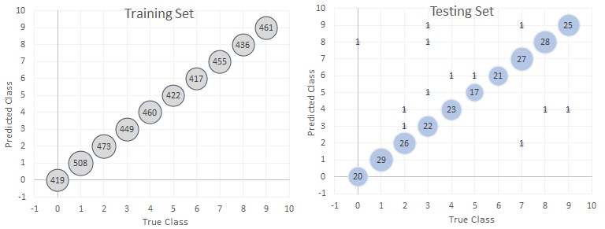

But if we look at the some of the wrong predictions it made, like the two shown below. It misclassified a 9 as 4 and a 5 as 6. I would say it's also quite difficult for a human to say what these two number are with 100% certainty.

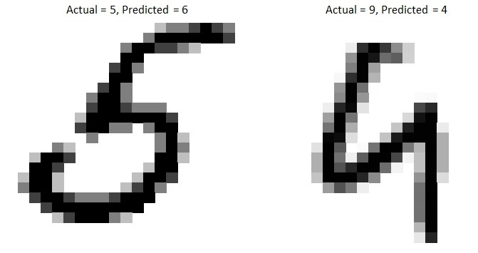

If we look at how the accuracy changed over the training cycles, we can see that the performance kept improving on the training set, but stopped improving after the fifth epoch. This could be a sign of overfitting, and we may either pick the model as of the fifth epoch, or change the architecture to achieve a better validation error.

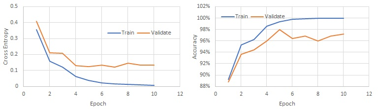


## Commonly used loss function and activation function at the output layer
Here are some commonly used functions and their respective derivatives and deltas listed for easy reference. *t<sub>i</sub>* is the target output at node *i*, *y<sub>i</sub>* and *x<sub>i</sub>* are the output and input to node *i*.

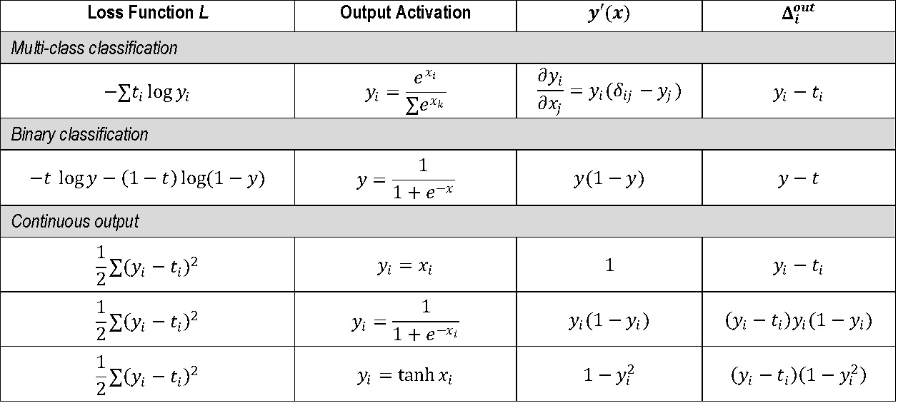

To calculate gradient of the loss function with respect to weights at the *k*-th layer, we backpropagate the gradient using:

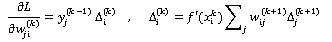

To put in words, gradient of weight *w<sub>ji</sub>* is equal to its input multiplied by the delta at the exiting node. And delta at node *i* of the *k*-th layer is given by weighted sum of deltas from connected nodes in the next layer, modulated by its own gradient.


## Decision Tree and Random Forests Regression/Classification

Requires: [cRForest.cls](Modules/cRForest.cls), [cCART.cls](Modules/cCART.cls), [modMath.bas](../../../Scientific-Toolkit/blob/master/Modules/modMath.bas)

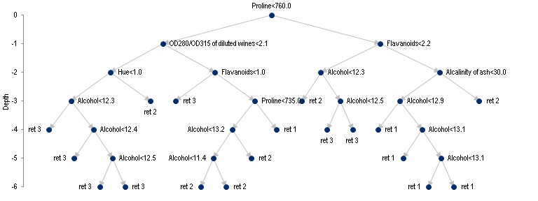

Decision tree regression is very simple in idea. We want to predict a response *y* given a multi-dimensional feature vector ***x***. To do that, we construct a binary tree where each non-leaf node contains two information: splitting dimension *k* and a corresponding splitting value *v<sub>k</sub>*. To make a prediction given ***x***, we traverse down the tree, starting from the root. At each node, if the splitting dimension of ***x*** is smaller than its splitting value, i.e. *x<sub>k</sub> < v<sub>k</sub>*, we proceed to the left child, otherwise we head right. This repeats until we hit a leaf node where there is no further split, and the node contains a value of the reponse variable, which will be taken as our prediction. The schemetics above shows a sample tree that predicts amount of rainfall in millimeters based on 4 variables: humidity, temperature , wind speed and altitude.

It follows that if a tree is of depth 1, i.e. it only has 3 nodes: root, left child and right child, then only two responses are possible. For a tree of depth *D*, the number of possible outcomes grows exponentially as 2<sup>D</sup>. This is illustrated in the example below where a 1-dimension problem is fitted to decision trees of different depths. When depth=1, it simply fits two levels to the reponse value. When depth=4, 16 levels are allowed etc. As the depth increases, an almost exact fit to the signal can be produced. To avoid overfitting, we can stop splitting a node if it reaches a maximum depth, or when it contains only a minimum size of training samples.

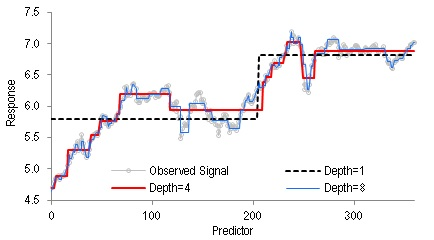

Random forest regression takes the same idea futher. Instead of using only one decision tree, we build multiple trees to form a forest. To make a prediction, we simply take prediction from each individual tree and average their outputs. The reason that it's called "random" is because when buidling each single tree, we use randomly drawn training samples from the full training set, so each of them grows differently. Another element of randomness is that during the training process, at each non-leaf node, we only consider a random subset of features when deciding which dimension to split. This way we end up having an ensemble of trees with each following slightly different decision path. Empirically this has proven to improve generalization.

We illustrate the syntax with diabetes data that can be found here. It consists of *N*=442 observations of diabetes reponse, and *D*=10 predicting variables. To begin we take *N<sub>1</sub>*=352 samples as training set. Simply store the response variable in a vector of *y(1:N<sub>1</sub>)* and the predictors in an array *x(1:N<sub>1</sub>,1:D)*. The remaining samples are reserved as testing set and stored in an array *x_out*.  We can then fit a random forest on the training set, and make predictions on testing set using the following syntax:

```
Dim RF1 As cRForest
Set RF1 = New cRForest
With RF1
    'fit y with x using forest with 100 trees of maximum depth of 12 and constraint leaf node at a minimum size of 5
    Call .Fit(y, x, 100, 5, 12, False, 0, "LOG", oob_err, oob_output)   
    Call .Predict(x_test, y_out)  'predict response from x_test() and store the output in y_out()
    Call .Print_Model(wkshtRng)   'save forest to an Excel range specified by upper-leftmost cell
    Call .Read_Model(wkshtRng)    'Read forest from an Excel range specified by upper-leftmost cell
End With
```

In the screenshot below I am showing how the prediction error varies with the depth of each tree and number of trees in a forest. On the left, we keep everything else fixed but vary the allowable depth of each tree. It's easily seen that as a tree grows deeper, it learns all the minute detail of the training samples. In fact it's possible to get zero error by simply growing the tree deep enough so each training sample occupy one leaf node. The generalization error (testing and out-of-bag) however stops improving once it becomes too deep, which means the tree has overfit. On the other hand, if we keep the depth fixed but increase number of trees in our forest, both training and generalization errors improve with more trees, but as we add more trees the improvment becomes less and less significant.

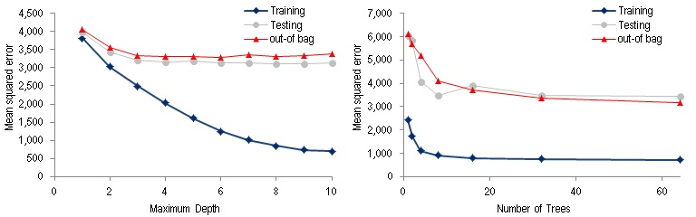

The discussion above is based on regression on continuous reponse, but you can easily imagine the exact same logic follows for a classification task. Syntax-wise, all we need to change is the repsonse *y* will now hold integers representing each class label. And the output error will be assessed by their classification error instead of mean squared error. When fitting a classification model, the 6th and 7th argument of `.Fit` method will be set to TRUE and the number of classes respectively
```
Call RF1.Fit(y,x,,,,TRUE,3,"LOG",oob_err,oob_output)   'Classification task with 3 possible outcomes
```
